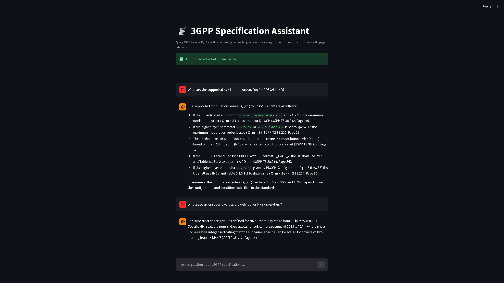
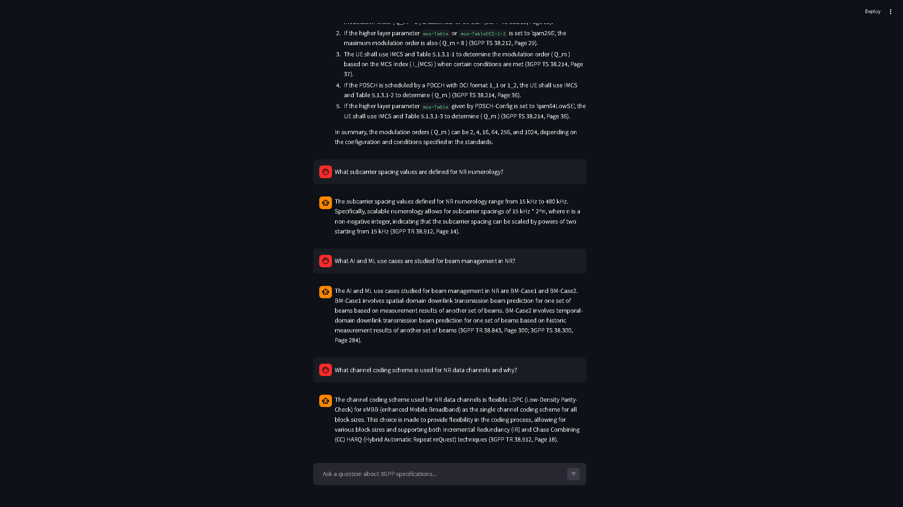

# 3GPP Specification Assistant — Production RAG System

A retrieval-augmented generation (RAG) system for querying 3GPP 5G/6G technical
specifications using natural language. Engineers and researchers can ask questions
in plain English and receive precise, cited answers grounded in the source documents
— no more manual searching through hundreds of pages of dense standards text.

---

## What it does

- Accepts natural language queries about 3GPP NR specifications
- Retrieves the most semantically relevant passages from a corpus of 14 Release 18/19 specs
- Generates grounded answers with exact source document and page number citations
- Serves answers via a REST API (FastAPI) and a chat interface (Streamlit)
- Traces every pipeline run in LangSmith for debugging and monitoring

**Example query:** *"What are the supported modulation orders Qm for PDSCH in NR?"*

**Example answer:** PDSCH supports QPSK (Qm=2), 16QAM (Qm=4), 64QAM (Qm=6), and
256QAM (Qm=8) — (3GPP TS 38.211, Page 32)

---

## Demo





---

## Corpus

14 3GPP Release 18/19 specifications — 4,493 pages, 18,187 chunks indexed in ChromaDB:

| Spec | Title |
|------|-------|
| TS 38.104 | NR; Base station radio transmission and reception |
| TS 38.211 | NR; Physical channels and modulation |
| TS 38.212 | NR; Multiplexing and channel coding |
| TS 38.213 | NR; Physical layer procedures for control |
| TS 38.214 | NR; Physical layer procedures for data |
| TS 38.215 | NR; Physical layer measurements |
| TS 38.300 | NR; Overall description |
| TS 38.331 | NR; Radio Resource Control (RRC) protocol |
| TS 38.401 | NG-RAN; Architecture description |
| TS 38.410 | NG-RAN; General aspects and principles |
| TR 38.843 | AI/ML for NR air interface |
| TR 38.873 | MIMO enhancements for NR |
| TR 38.912 | Study on new radio access technology |

---

## Architecture

**Offline indexing (run once):**

```
PDF specs → PyPDF loader → RecursiveCharacterTextSplitter (1000 chars, 200 overlap)
         → OpenAI text-embedding-3-small → ChromaDB (18,187 chunks stored to disk)
```

**Online query serving (per request):**

```
User query → ChromaDB similarity search (k=5) → GPT-4o-mini with citation prompt
           → Grounded answer with source citations
           → FastAPI /query endpoint ← Streamlit chat UI
```

## RAGAS Evaluation

Evaluated on a 10-question test set covering physical layer, architecture, and
RRC topics across the corpus:

| Metric | Score |
|--------|-------|
| Faithfulness | 0.675 |
| Answer relevancy | 0.628 |
| Context precision | 0.675 |
| Context recall | 0.750 |

Scores above 0.6 across all four metrics indicate reliable retrieval and
grounded generation for domain-specific technical documents. Context recall
of 0.750 reflects strong corpus coverage across the full NR physical layer
stack. Context precision remains the primary lever for future improvement,
as dense 3GPP tables and cross-references do not always chunk cleanly.

---

## Tech stack

- **Ingestion:** LangChain, PyPDF, RecursiveCharacterTextSplitter
- **Embeddings:** OpenAI text-embedding-3-small
- **Vector store:** ChromaDB (local), extensible to Pinecone
- **LLM:** GPT-4o-mini via OpenAI API
- **Orchestration:** LangChain LCEL, LangGraph-ready
- **Backend:** FastAPI + Uvicorn
- **Frontend:** Streamlit
- **Evaluation:** RAGAS (faithfulness, answer relevancy, context precision, context recall)
- **Monitoring:** LangSmith tracing
- **Environment:** conda (Python 3.11)

---

## Project structure

```
3gpp-rag/
├── data/
│   └── raw/                  # 3GPP PDF specs (not tracked in git)
├── notebooks/
│   ├── 01_ingestion_test.ipynb
│   ├── 02_chunking_and_embedding.ipynb
│   ├── 03_rag_chain.ipynb
│   └── 04_evaluation.ipynb
├── src/
│   └── api/
│       └── main.py           # FastAPI backend
├── frontend/
│   └── app.py                # Streamlit chat interface
├── .env.example
└── README.md
```

## Running locally

**1. Clone the repo and create the environment:**
```bash
git clone https://github.com/nabeegh-khan/3gpp-rag.git
cd 3gpp-rag
conda create -n rag3gpp python=3.11 -y
conda activate rag3gpp
pip install langchain langchain-openai langchain-community langchain-chroma \
    langchain-text-splitters openai chromadb pypdf python-dotenv fastapi \
    "uvicorn[standard]" streamlit ragas langsmith requests tqdm datasets numpy
```

**2. Add API keys:**
```bash
cp .env.example .env
# edit .env and add your OPENAI_API_KEY and LANGSMITH_API_KEY
```

**3. Download 3GPP specs and build the vector store:**

Download Release 18/19 specs from https://www.3gpp.org/ftp/Specs/archive/38_series/
and save PDFs to `data/raw/`. Then run notebooks 01 and 02 in order.

**4. Start the API server:**
```bash
uvicorn src.api.main:app --reload --port 8000
```

**5. Start the Streamlit frontend:**
```bash
streamlit run frontend/app.py
```

**6. Query via curl:**
```bash
curl -X POST http://127.0.0.1:8000/query \
  -H "Content-Type: application/json" \
  -d '{"question": "What modulation schemes are supported for PDSCH in NR?"}'
```

---

## Author

Nabeegh Khan — MEng Candidate Electrical & Computer Engineering, University of Toronto

[GitHub](https://github.com/nabeegh-khan)

---

## AI Assistance Disclosure

This project was built using Claude (Anthropic) as the primary development assistant. Architecture decisions, LangChain pipeline design, ChromaDB ingestion strategy, FastAPI implementation, RAGAS evaluation setup, and debugging were all developed through an iterative dialogue with Claude. I directed the goals, made decisions about corpus scope and evaluation methodology, executed every step locally, and validated outputs — but I would not claim independent authorship of the technical design.

I'm disclosing this transparently because honest AI usage is more valuable to the ML community than presenting AI-assisted work as fully independent. My contribution was in scoping the problem domain (3GPP/6G standards), running and validating the full pipeline, interpreting the RAGAS results, and learning the production RAG stack through hands-on execution — not in originating the technical solutions from scratch.