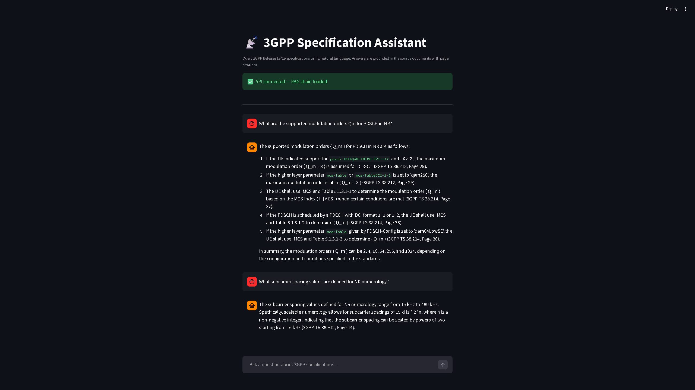
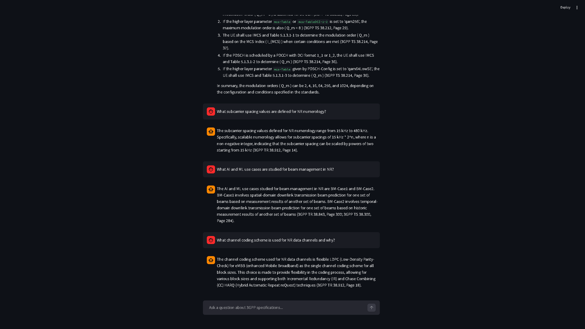

# 3GPP Specification Assistant (RAG)

A retrieval-augmented QA system over 3GPP 5G/6G specifications. Ask a question in plain English and get an answer grounded in the specs, with the source document and page cited.

**TL;DR.** Indexed 13 3GPP NR specs (4,493 pages, 18,187 chunks) in ChromaDB and answer questions with GPT-4o-mini, returning citations to the exact spec and page. On a 10-question test set, RAGAS scores faithfulness 0.675 and context recall 0.750. It's a working prototype with honest, not production-grade, retrieval quality.

**Demo:** [watch it run on YouTube](https://youtu.be/tEcylKm4xwk).

## Problem

3GPP specifications are long, cross-referenced, and dense. Finding the one clause that answers a specific question ("what modulation orders does PDSCH support?") usually means grepping across hundreds of pages in several documents. A retrieval-augmented system can pull the relevant passages and let an LLM answer from them, with citations so you can check the source rather than trust the model.

**Example.** *"What are the supported modulation orders Qm for PDSCH in NR?"* → QPSK (Qm=2), 16QAM (Qm=4), 64QAM (Qm=6), 256QAM (Qm=8), cited to 3GPP TS 38.211.

## What it does

- Takes a natural-language question about NR specifications.
- Retrieves the most relevant passages from the indexed corpus.
- Answers with GPT-4o-mini, grounded in the retrieved passages and citing the source spec and page.
- Serves through a FastAPI endpoint and a Streamlit chat UI, with LangSmith tracing on each run.


*Answers to modulation-order and subcarrier-spacing questions, each with source citations.*


*Answers on beam-management ML use cases and channel coding, with citations.*

## Corpus

13 3GPP Release 18/19 specifications, 4,493 pages, 18,187 chunks in ChromaDB.

| Spec | Title |
|---|---|
| TS 38.104 | NR; Base station radio transmission and reception |
| TS 38.211 | NR; Physical channels and modulation |
| TS 38.212 | NR; Multiplexing and channel coding |
| TS 38.213 | NR; Physical layer procedures for control |
| TS 38.214 | NR; Physical layer procedures for data |
| TS 38.215 | NR; Physical layer measurements |
| TS 38.300 | NR; Overall description |
| TS 38.331 | NR; Radio Resource Control (RRC) protocol |
| TS 38.401 | NG-RAN; Architecture description |
| TS 38.410 | NG-RAN; General aspects and principles |
| TR 38.843 | AI/ML for NR air interface |
| TR 38.873 | MIMO enhancements for NR |
| TR 38.912 | Study on new radio access technology |

## Approach

**Indexing (once):**
```
PDF specs → PyPDF loader → RecursiveCharacterTextSplitter (1000 chars, 200 overlap)
          → OpenAI text-embedding-3-small → ChromaDB (18,187 chunks on disk)
```

**Query (per request):**
```
question → ChromaDB similarity search (k=5) → GPT-4o-mini with a citation prompt
         → grounded answer + citations → FastAPI /query ← Streamlit UI
```

Key choices: fixed-size character chunking with overlap as a simple, reproducible baseline; `k=5` retrieved chunks per query; and a prompt that requires the model to cite the retrieved sources, so answers are checkable against the specs.

## Evaluation

RAGAS on a 10-question test set spanning physical-layer, architecture, and RRC topics.

| Metric | Score |
|---|---|
| Faithfulness | 0.675 |
| Answer relevancy | 0.628 |
| Context precision | 0.675 |
| Context recall | 0.750 |

Recall at 0.750 says retrieval usually pulls the relevant passage. Faithfulness and context precision, both 0.675, say the answers are mostly grounded but not always, and that retrieval pulls some irrelevant chunks alongside the right ones. Answer relevancy is the lowest at 0.628, which is what you would expect downstream of imprecise context: the model answers from a mix of relevant and off-target passages, so the response drifts from the question. The likely root cause is segmentation rather than the model. 3GPP tables and cross-references don't chunk cleanly with fixed-size splitting, so a chunk can carry a fragment of a table without its header. The 10-question set is small, so treat these as indicative, not definitive.

## Run it

```bash
git clone https://github.com/nabeegh-khan/3gpp-rag.git
cd 3gpp-rag
conda create -n rag3gpp python=3.11 -y
conda activate rag3gpp
pip install -r requirements.txt
```

Add your keys (never commit them):
```bash
cp .env.example .env      # then add OPENAI_API_KEY and LANGSMITH_API_KEY
```

Download the Release 18/19 specs from the [3GPP archive](https://www.3gpp.org/ftp/Specs/archive/38_series/) into `data/raw/`, then run notebooks `01` and `02` to build the vector store. Start the API with `uvicorn src.api.main:app --port 8000` and the UI with `streamlit run frontend/app.py`.

```
3gpp-rag/
├── data/raw/               # 3GPP PDFs (gitignored)
├── notebooks/              # 01 ingestion → 02 embedding → 03 chain → 04 evaluation
├── src/api/main.py         # FastAPI backend
├── frontend/app.py         # Streamlit UI
├── .env.example
├── requirements.txt
└── README.md
```

## Limitations and next steps

- **Retrieval precision is the bottleneck.** Fixed-size chunking breaks 3GPP tables and cross-references. Table-aware or structure-aware chunking, and a reranker over the top-k, are the obvious next steps.
- **Small evaluation set.** 10 questions is enough to see where it stands, not enough to trust the exact numbers. A larger, categorized test set would make the RAGAS scores meaningful.
- **No abstention.** The system always answers. It has no selective-prediction step that detects when retrieval has missed and returns "not found" instead of answering from weak context, and it reports accuracy without reporting coverage. Given that context precision is the bottleneck, abstaining on low-evidence queries would likely raise faithfulness on the questions it does answer.
- **Costs and dependencies.** Uses the OpenAI API for embeddings and generation, so running it costs money and depends on an external service; a local embedding model and open LLM would remove that.

## References

- 3GPP Release 18/19 NR specifications, [3GPP archive](https://www.3gpp.org/ftp/Specs/archive/38_series/).
- Es et al. "RAGAS: Automated Evaluation of Retrieval Augmented Generation." 2023.
- Lewis et al. "Retrieval-Augmented Generation for Knowledge-Intensive NLP Tasks." NeurIPS 2020.

## Authorship and tooling

I scoped the corpus to 3GPP Release 18/19 NR specs, designed the pipeline and the evaluation, ran the ingestion against the real specs, and validated answers against the source documents and interpreted the RAGAS scores. I used Claude (Anthropic) as a coding assistant to speed up implementation and debugging; I reviewed, tested, and modified the generated code and am responsible for its correctness. The research decisions, analysis, and conclusions are my own.
